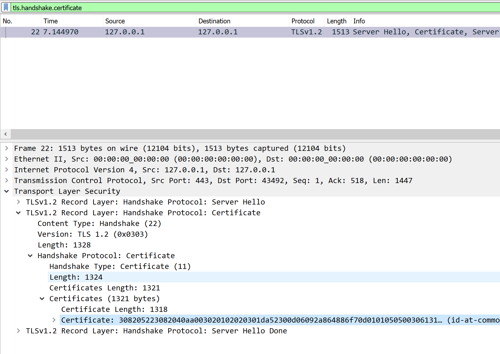

# [CSS Exam - 04] TLS / SSL Network Traffic Analysis (30' / 15 Pt)

Introduction

One of your customers has mentioned that everybody receives a warning about an untrusted connection when connecting to their database through phpMyAdmin web interface.
Goal & Tasks

Analyze the given network capture and reply to the following 6 questions directly in the template from the resources section.

1.Why does the customer receive a message about an untrusted connection?

**When inspecting the certificate stream, we can see that the certificate has expired and is no longer valid**


2. What is the common name (CN) of the certificate?

**When exporting the certificate from the traffic, we can open the `.der` file and can see that the certificate belongs to securelogin.arubanetworks.com**

3. What is the subject serial number of the used certificate?

**The serial number is lLUge2fRPkWcJe7boLSVdsKOFK8wv3MF**


4. What are the credentials of the admin account?

**After searching for the subject serial number, I found out that the RSA private key has been compromised. The private key is publicly available which allows us to decrypt the traffic.. The username is admin and the password is M8JRjl9ydZfdxrhuvaeKJc2D90zwg7Uq**

5. What is the first and last name of the user with ID 1337?
**When logging into the Database with the credentials we can query the customer table and get Leonard Euler**

6. What should be done to prevent someone from decrypting the data even if they have access to a PCAP file and a matching private key from the server?
**As described below**

Hint: Use the phpMyAdmin interface from the resources section to verify 5. What is the first and last name of the user with ID 1337?
Hint: You need the phpMyAdmin interface to answer this question 6. What should be done to prevent someone from decrypting the data even if they have access to a PCAP file and a matching private key from the server?
Submission

Completed PDF document with answers to the 6 questions mentioned in the goal section.


## Task 1
This sounds pretty much like a problem with the certificate.
In Wireshark we can use the filter ``tls.handshake.certificate`` to see all traffic related to the TLS handshake.
There is one packet that seems to be the exchange of the certificate.

When inspecting the certificate properties we can see that the certificate is not valid anymore because it has expired.
It is valid from ``11.05.11 - 11.08.17``
When checking HTTP traffic, we can see the one has been mate at ``Sep  5, 2019 14:40:28.965020000 Mitteleuropäische Sommerzeit``

# Task 2
When opening the Certificate stream, we can rightclick the "certificate" pane and export the packet bytes and.
Like this we get the certificate in a ``der`` format.

Or with tshark
```bash
└─$ tshark -r css-04-traffic.pcap -Y tls.handshake.certificate -T fields -e tls.handshake.certificate | xxd -r -p > cert
.der
└─$ file cert.der
cert.der: Certificate, Version=3
```
With this information we can see that the certificate belongs to **securelogin.arubanetworks.com**
There are a lot of other methods for this. But this method is definitely the clearest one.


# Task 3

We can use ``tshark -r css-04-traffic.pcap -Y tls.handshake.certificate -T pdml | grep -i "serial"`` to print all the data and grep for the serial number.
``id-at-serialNumber=lLUge2fRPkWcJe7boLSVdsKOFK8wv3MF``

# Task 4 (Guessy stuff ahead)
Tshark allows us to easily show the cipher suite used in the key exchange.
```bash
└─$ tshark -r css-04-traffic.pcap -Y tls.handshake.certificate -T fields -e tls.handshake.ciphersuite
0x0035
```
Searching for this on Google we find [this one](https://support.microfocus.com/kb/doc.php?id=7024191) that tells us it's ``TLS_RSA_WITH_AES_256_CBC_SHA `` which does not use ephemeral keys.
If the private key is leaked, we can easily decrypt the traffic.

Since I am one of the best guessers out there, I tried to google the subject serial number and found a news article that mentions a compromised certificate for the exact domain.
Now we can decrypt the traffic with either Wireshark or Tshark.

```bash
for x in {0..100}; do tshark -r css-04-traffic.pcap -q -o "tls.keys_list:127.0.0.1,443,http,key.pem" -z "follow,tls,ascii,$x" |grep -i "pass"; done
pma_username=admin&pma_password=M8JRjl9ydZfdxrhuvaeKJc2D90zwg7Uq&server=1&target=index.php&token=6e1213a5262a050eeb749d2e049a85ab
```
Tadaaa

# Task 5

Since we got a phpmyadmin instance we can use our credentials and login and execute queries.
There is a customer table.
```SQL
SELECT * FROM `customers` WHERE id = 1337
```
And we get Leonard Euler

# Task 6
The server could forbid connections that want to use cipher suites without PFS. This is essential for confidential communication.